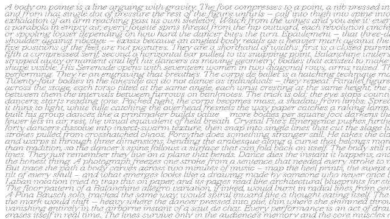

{ .illu-thumb .illu-front }

With Vexy Lines, you can make the most of your variable fonts. Create expressive typographic arrangements, impactful headlines and font specimens. Check out the [Vexy Lines case study: Text fill](https://vexy.art/lines/case-typography/)! It typesets your text along the baselines created by the app’s procedural patterns. Each text glyph picks its font size or variable font instance from the brightness of the image beneath it. Sampled per glyph. Mapped to Weight, Width, Optical Size, or any other axis. Exported to SVG & PDF. For foundries who want to show their design spaces flow along pixels.

<!-- more -->

<vexy-before-after before="https://i.vexy.art/vl/case-text/vexy3d-7-before.jpg" after="https://i.vexy.art/vl/case-text/vexy3d-7-after.png" before-label="Source image" after-label="Text fill" position="50" direction="horizontal" aspect="1/1" rounded="6px" style="display: block; width: 100%; max-width: 1024px; margin: 0 auto"></vexy-before-after>

What do Vexy Lines and FontLab have in common? Same developers, and same passion for high-quality typography. So, even though Vexy Lines is our new Mac & Windows app for parametric creation of vector graphics — of course we added a unique typographic gem it: Text fill. If you make or use variable fonts — it’s a must!

Drop in a source image, Put a base fill over it, and hide it — Linear, Wave, Circular, Spiral, Handmade, or even Halftone! Apply Filters like Contrast or Blur to the base fill to tweak the impact of the source image.

Add a Text fill based on the first fill. The pattern paths of the base fill decide where and how the baselines in the Text fill will flow. Enter your text, pick a variable font, nominate a variation axis — and watch Vexy Lines work its variable magic.

[{ .ml-[-1em] }](https://vexy.art/lines/case-typography/){ .w-full }

As the text flows along the pattern paths, Vexy Lines samples the image brightness under each glyph, and uses it to choose the font size and the instance — so your bitmap becomes the UI for your variable font! A simple linear gradient from white to black plus a variable Futura gives the pretty gradient above, made out of typographic color.

The image brightness modulates the stroke thickness within the thickness range in the hidden base fill. This, in turn, modulates the font size in the Text fill. Lighter pixels — thinner stroke — smaller glyphs. Make the min and max thickness the same for a constant font size.

{ .w-1/2 .float-right .ml-6 .mb-4 }

Additionally, the image brightness directly drives the variable instance selection along the nominated axis, one interpolated instance per glyph. This works even if the min and max stroke thickness are the same. If you choose Weight, light pixels will give you light letters, dark pixels give you bold glyphs.

[Discover variable typography in Vexy Lines →](https://vexy.art/lines/case-typography/){ .md-button .md-button--primary }
