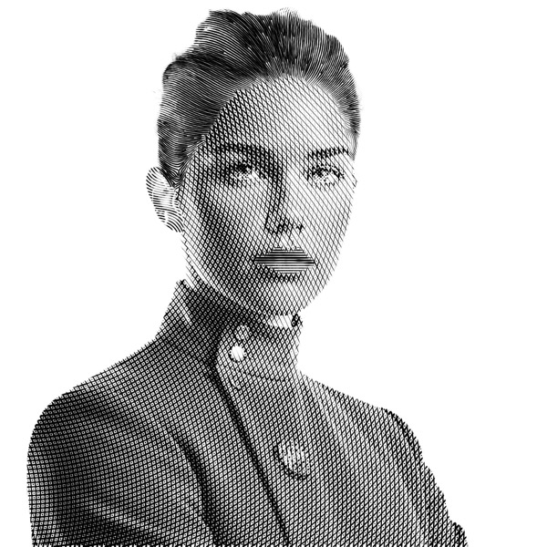

{ .illu-thumb .illu-front .illu-photo }

Many headshots, many cameras, one team photoshoot: with Vexy Lines, you can turn low-quality photos into visually harmonized, crisp SVGs & PDFs. Turn your starship crew into WSJ-style hedcuts or brutalist stipples, and showcase them from avatar to hero. This [look is worth every penny](https://vexy.art/lines/case-portraits/)!

<!-- more -->

 <vexy-before-after before="https://i.vexy.art/vl/case-portraits/hedcpt-elara-src-2048x2048.jpg" after="https://i.vexy.art/vl/case-portraits/hedcpt-elara-2048x2048.jpg" before-label="Photo" after-label="Vexy Lines" position="38" direction="vertical" aspect="1/1" rounded="6px" style="display: block; width: 100%; max-width: 1280px; margin: 0 auto"></vexy-before-after>

Vexy Lines reads a photo as pure light and shade, then redraws every tone as a pattern of strokes, layer by layer, until a raw snapshot becomes clean line art that still looks like the person.

The quiet payoff is the next hire. Save the look once, drop in whoever starts on Monday, and your corporate crypto banknote series stays consistent without a design meeting or a reshoot. The team page, that is.

[Read the Vexy Lines case study: Team portrait →](https://vexy.art/lines/case-portraits/){ .md-button .md-button--primary }
