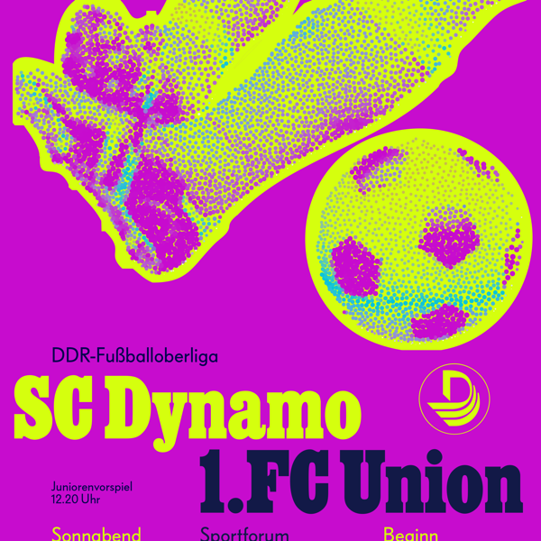

{ .illu-thumb .illu-front .illu-photo }

In 1977, Albert Kapr squeezed poster style out of cheap GDR paper and a one-colour press. The [Vexy Lines case study: retro poster](https://vexy.art/lines/case-retro-poster/) scans his SC Dynamo sheet, rebuilds the halftone photo into a vector signal where stroke thickness answers to luminance, and pours one photograph into three posters: faithful linear, colour-soaked, and full brutalist for the scrolling feed.

<!-- more -->

Here is what happens when you stop worshipping the museum glass and start reverse-engineering it. We scanned the poster, rebuilt the halftoned photo back into continuous tone, then dropped that grayscale image into Vexy Lines.

    

Out come retro-authentic vector-perfect ultrasized linear halftones! The reverent direction is black on white, the same line-screen idea Kapr used, now vector artwork that scales past anything a 1977 press could dream of printing.

Take the method, bring it into today: Start with a photo, let the lines carry the tone, then decide whether the gig wants faithful, fluorescent, or feral: and let the engine do the redrawing while you do the deciding!

[Read the Vexy Lines case study: Retro poster revival →](https://vexy.art/lines/case-retro-poster/){ .md-button .md-button--primary }
